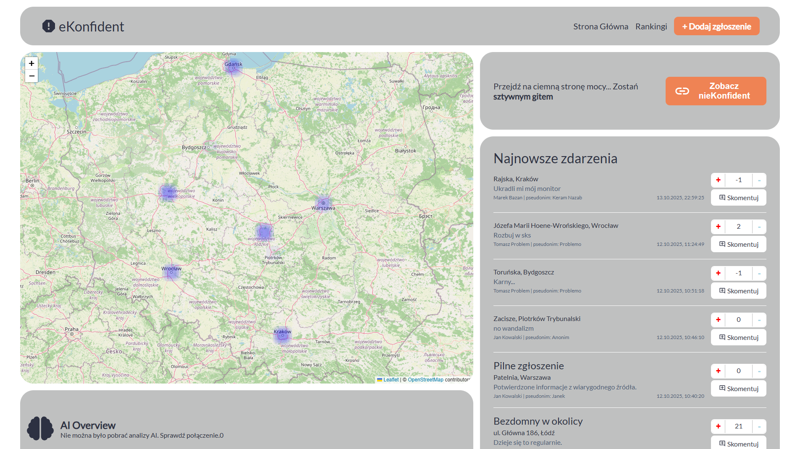
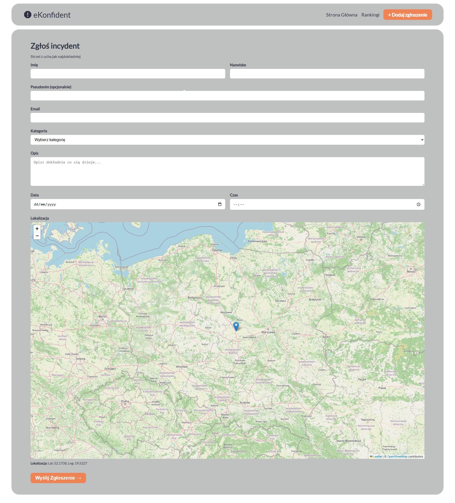
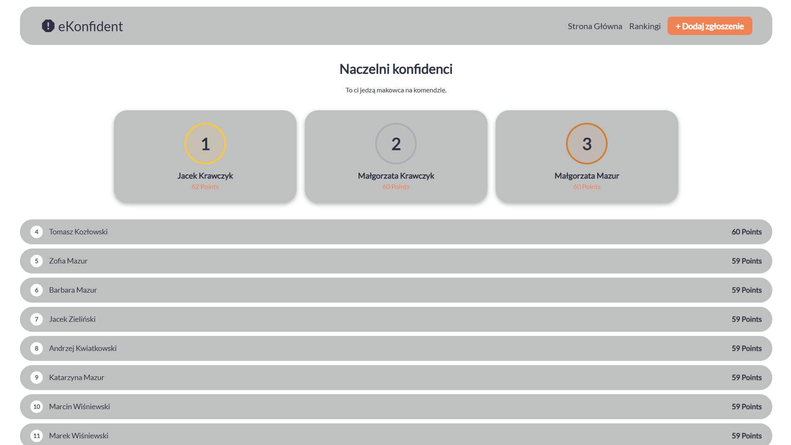
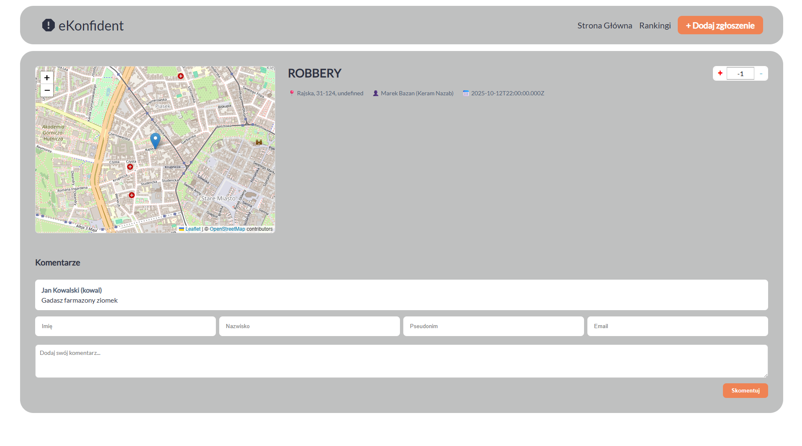

# eKonfident (Frontend)

> **BestHacks 2025 Hackathon Project** | **Topic:** Public Safety

**eKonfident** is a gamified, community-driven web application designed to improve public safety by allowing citizens to easily report and track local incidents. Built with a touch of humor (embracing the local "neighborhood snitch" meme culture), the platform encourages active participation through leaderboards, community voting, and real-time map visualizations.

> [!TIP]
> For the evil twin of eKonfident visit [nieKonfident](https://github.com/Lorem-Ipsum-BestHACKS-2025/nieKonfident-frontend) - the dark side for the "Good Homies". Featuring **dark mode**.

## Key Features

* 🗺️ **Interactive Incident Map:** View real-time reports and heatmaps of incidents across the country using an interactive map (powered by Leaflet/OpenStreetMap).
* 📝 **Quick Reporting:** A form to report incidents with precise geolocation, category tagging, and detailed descriptions.
* 🏆 **Gamification & Leaderboards:** Users earn points for verified reports. The **Top Snitches** leaderboard ranks the most active community members.
* 👍 **Community Verification:** Users can upvote or downvote incidents to filter out fake reports and increase the visibility of real threats.
* 💬 **Comments System:** Discuss specific incidents, provide additional information, or warn others in the comment section under each report.
* 🤖 **AI Overview:** Integration for AI-powered safety analysis of specific areas based on recent incident data.

## Screenshots

| Main Dashboard & Map | Incident Reporting Form |
| :---: | :---: |
|  |  |
| **Leaderboards (Ranking)** | **Incident Details & Comments** |
|  |  |

## Tech Stack

* **Frontend Framework:** React
* **Styling:** CSS modules
* **Maps:** Leaflet & OpenStreetMap

## Getting Started

To get a local copy up and running, follow these simple steps.

### Prerequisites

* Node.js (v16 or higher recommended)
* npm or yarn

### Installation

1. Clone the repository:

  ```sh
  git clone https://github.com/Lorem-Ipsum-BestHACKS-2025/eKonfident-frontend.git
  ```

2. Navigate to the project directory:

  ```sh
  cd eKonfident-frontend
  ```

3. Install dependencies

  ```sh
  npm install
  # or
  yarn install
  ```

4. Configure environment variables:
    - Modify .env file in the root directory and add your API endpoints.

5. Start the development server:

  ```sh
  npm run dev
  # or
  yarn dev
  ```
